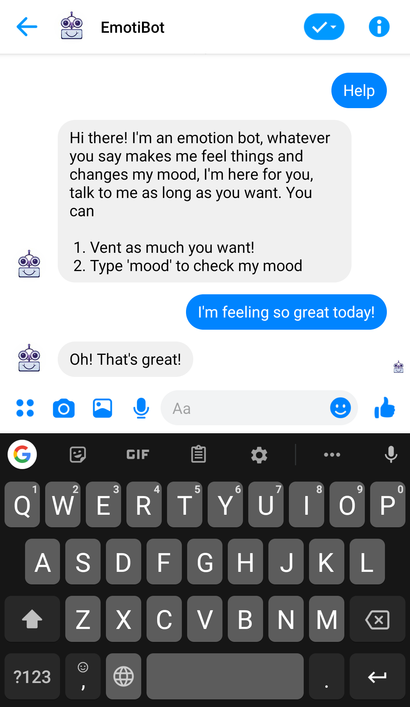

# EmotiBot


### Description

#### An Emotion Bot setup on Facebook Messenger which changes it's feelings and responds based on what you say to it. It will become happy or sad while talking to you by using the IBM Watson Tone Analyzer for analysis

## Table of Contents

  * [Key Features](#key-features)
  * [Demo](#demo)
  * [Usage](#usage)
  * [Built With](#built-with)
  * [Screenshots](#screenshots)


<a name="key-features"></a>
## Key Features


* Emotibot can be accessed through the Facebook page or messenger.
* EmotiBot responds to the user by analyzing what they are saying. Its mood changes with each text sent by the user.
* EmotiBot is everyone's friend. The mood for each user is separated and distinct.
* You can send two special messages to EmotiBot
  - **Help** - Emotibot responds with a help text explaining who it is and what you can say to it.
  - **Mood** - You can check EmotiBot's current mood by typing in 'mood'. It has 5 separate moods and corresponding reply texts which are Positive, Positive-Neutral, Neutral, Negative-Neutral, and Negative
* Emotibot is a **smart bot**. It knows how human emotions work. **It gives more preference to the messages which are recent**. For example, if you sent a sad message an hour ago and a happy message in the last 5 minutes, EmotiBot will be more happy than sad
* It **flushes out old and irrelevant messages** by running a scheduler in specific intervals in the background.
  - The best thing is you can set the interval period, it is 2 hours by default.
  - You can also decide what messages are relevant by changing how long a message should be deemed relevant in the application. By default, it is 60 minutes.


<a name="demo"></a>
## Demo

You can check the [facebook page](https://www.facebook.com/EmotiBot-343970259597074) or message EmotiBot directly on [messenger](http://m.me/343970259597074)

##### Note: Unfortunately, the app is in development as of now. Send a message and wait till I can add you as a tester through facebook for developers, and then you can start chatting with EmotiBot.

<a name="usage"></a>
## Usage

##### Note: We provide defaults for everything, so the application will run out of the box. Although, to custimize your application you need to go through setup.

Installation

```bash
# Clone this repository
$ git clone https://par010@bitbucket.org/par010/emotionbot.git

# Go into the repository
$ cd emotionbot

# Install requirements
$ pip install -r requirements.txt

# Run the app
$ python app.py
```

Setup Process

```bash
# install virtual environment
$ pip install virtualenv

# create virtual environment for you folder
$ cd project_folder
$ virtualenv venv

# setup python interpreter of your choice
$ virtualenv -p /usr/bin/python3.6 venv

# activate the virtual environment
$ source venv/bin/activate

# setup environment variables

# This is the verification token you set for facebook webhook verification
$ export VERIFICATION_TOKEN = 'YOUR-VERIFICATION-TOKEN'

# Your IBM Watson Tone Analyzer API key
$ export IBM_WATSON_APIKEY = 'YOUR-IBM-WATSON-APIKEY'

# Your Mongo Databse URI setting
$ export DATABASE_URL = 'YOUR-DATABASE-URL'

# The Page Access Token for your facebook page
$ export PAGE_ACCESS_TOKEN = 'YOUR-PAGE-ACCESS-TOKEN'
```

Configuration

```bash
# In constants.py

# change to your IBM Watson Version
IBM_WATSON_VERSION = 'YOUR-IBM_WATSON_VERSION'

# change to your IBM Watson URL
IBM_WATSON_URL = 'YOUR-IBM_WATSON_URL'

# The number of minutes a message is kept track of, it is deleted after it expires
MINUTES_FOR_A_CHAT_SESSION = A-NUMBER-IN-MINUTES

# The message sent if the user sends 'help'
HELP_TEXT = 'CHANGE-TO-YOUR-TEXT'

# The number of hours in which the background function runs to clean needless messages
SCHEDULED_HOURS = A-NUMBER-IN-HOURS


```

<a name="built-with"></a>
## Built With


* **Flask** - Flask is a Python web framework.Flask can be used for building complex , database-driven websites,starting with mostly static pages.

* **Facebook Messenger API** - It is a chat platform which can be used to build bots

* **IBM Watson Tone Analyzer** - Understand emotions and communication style in text.

* **PyMongo** -  Python distribution containing tools for working with MongoDB, and is the recommended way to work with MongoDB from Python.

<a name="screenshots"></a>
## Screenshots


